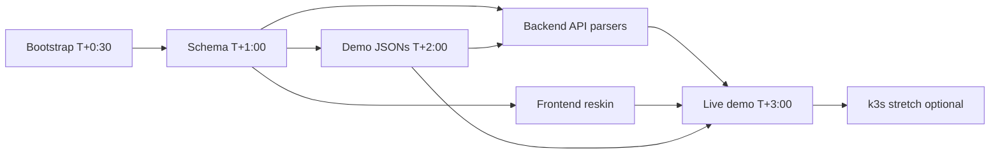

# StateProof — 4-Hour Build Plan

> Engine source: `C:\Users\salam\Projects\SynchronAIse` — port, re-skin, point at cars.
> **Feature freeze T+3:00.** Not green by then → ship in MOCK_MODE.
> Pitch + rehearsal → **tomorrow morning** (not during this build).

---

## Structure

Five people, **four tracks**. Backend is split into two owners so API work and AI/schema
work never block each other.

```
StateProof/
├── packages/contract/     ← Backend — AI (schema source)
├── backend/               ← Backend — AI + Backend — API
├── frontend/src/          ← Frontend track
├── demo/ground-truth/     ← Demo + deploy track
├── deploy/                ← Demo + deploy (k3s stretch, T+3:00 only)
└── main                   ← Integration track merges here
```

| Person | Track | Branch |
|--------|-------|--------|
| _assign_ | **Integration** | `feat/integration` |
| _assign_ | **Backend — AI & schema** | `feat/backend-ai` |
| _assign_ | **Backend — API & registry** | `feat/backend-api` |
| _assign_ | **Frontend** | `feat/frontend` |
| _assign_ | **Demo + deploy** | `feat/demo` / `feat/deploy-k3s` |

**Coordination rule:** schema frozen on `main` by **T+1:00**. If it changes, all five
people must know immediately.

---

## T+0:00 – T+0:30 — Bootstrap (everyone)

**Integration track only** ports code. Everyone else sets up env and reads this plan.

| Who | Task |
|-----|------|
| **Integration** | Port `packages/contract/`, `backend/`, `frontend/` from SynchronAIse (skip `action/`). MOCK_MODE end-to-end green. Merge `feat/integration` → `main` within 30 min. |
| **Everyone else** | `git pull` after bootstrap lands. Python + `uv`, Node, `backend/.env` with at least one of `NVIDIA_API_KEY`, `GEMINI_API_KEY`, `OPENAI_API_KEY`. Claim your track + branch. |

---

## Tasks by track

### Integration track

**Branch:** `feat/integration` · then merges all tracks to `main`

| # | Task | When | Done when |
|---|------|------|-----------|
| I1 | Port SynchronAIse (`packages/contract/`, `backend/`, `frontend/`) | T+0:00–0:30 | Old UI demo runs in MOCK_MODE |
| I2 | Merge bootstrap → `main` | T+0:30 | Everyone rebases |
| I3 | Merge backend + frontend + demo branches as they land | T+0:30–3:00 | MOCK_MODE green after each merge |
| I4 | Resolve merge conflicts (final say on ties) | ongoing | No broken `main` |
| I5 | Wire live demo: photo → plate → registry → scratch not chargeable | T+3:00 | Live path works once |
| I6 | End-to-end smoke test + tagged commit | T+3:30–4:00 | Full loop connects |

**Only this track merges to `main` during the build.**

---

### Backend — AI & schema

**Branch:** `feat/backend-ai` · **Critical path — on `main` by T+1:00**

| # | Task | File(s) | When |
|---|------|---------|------|
| B-A1 | Car element types: `front_bumper`, `hood`, `windshield`, `door_*`, `wheel_*`, `rear` | `backend/app/core/schema.py` | T+0:30–1:00 |
| B-A2 | Props: `condition`, `defects[]` (type, location, size) | `backend/app/core/schema.py` | T+0:30–1:00 |
| B-A3 | Audit fields: `asset_id` (plate), `contract_event` (`pickup` / `return`) | `backend/app/core/schema.py` | T+0:30–1:00 |
| B-A4 | Classification aliases: `damage`, `normal_wear`, `agreed_change` | `backend/app/core/schema.py` | T+0:30–1:00 |
| B-A5 | Mirror types for frontend | `frontend/src/types/contract.ts` | T+1:00 |
| B-A6 | Wear-and-tear taxonomy prompt (scratch thresholds, chip counts, standard citation) | `backend/**/classification.md` | T+1:00–2:00 |
| B-A7 | Heuristic fallback matching taxonomy (MOCK_MODE) | `backend/app/services/classifier.py` | T+1:00–2:00 |
| B-A8 | NVIDIA NIM provider (`NVIDIA_API_KEY`, `NVIDIA_MODEL`, OpenAI-compatible base URL) | `backend/app/core/config.py`, `vlm.py` | T+2:00–3:00 |
| B-A9 | Provider chain: **NIM → Gemini → OpenAI → heuristic** | `backend/app/services/vlm.py` | T+2:00–3:00 |

**Allowed paths:** `backend/app/core/schema.py`, `backend/**/classification.md`,
`backend/app/services/classifier.py` (heuristic), `backend/app/services/vlm.py`,
`backend/app/core/config.py`, `frontend/src/types/contract.ts`

**Do not touch:** parsers, `storage.py` registry, `frontend/src/**` UI components.

---

### Backend — API & registry

**Branch:** `feat/backend-api` · **Mock T+2:00, live VLM T+3:00**

| # | Task | File(s) | When |
|---|------|---------|------|
| B-P1 | Pickup parser: VLM fills checklist from photos | `baseline_parser.py` (was `figma_parser.py`) | T+1:00–2:00 |
| B-P2 | Return parser | `return_parser.py` (was `code_parser.py`) | T+1:00–2:00 |
| B-P3 | License plate extraction in VLM prompt | parsers + `vlm.py` | T+1:00–2:00 |
| B-P4 | Mock path: load JSONs from `demo/ground-truth/` | parsers | T+1:00–2:00 |
| B-P5 | Plate-keyed registry `{ baseline, audits[] }` | `backend/app/services/storage.py` | T+2:00–3:00 |
| B-P6 | Auto-link audit when plate recognized (no explicit `asset_id`) | `POST /audit` in `backend/app/api/` | T+2:00–3:00 |
| B-P7 | Keep `/report/{id}`, `/fix`, `/health` working | `backend/app/api/` | ongoing |

**Allowed paths:** parser modules, `storage.py` (registry), `backend/app/api/`,
`config.py` (NIM env keys only if not owned by B-A8 — coordinate with Backend — AI)

**Do not touch:** `schema.py`, `contract.ts`, classifier heuristic, `frontend/`, `demo/`.

**Depends on:** B-A1–A5 on `main` (T+1:00), demo JSONs (T+2:00).

---

### Frontend track

**Branch:** `feat/frontend` · **Done by T+3:00**

Work from seeded mocks — no live backend required, only stable `contract.ts`.

| # | Task | File(s) | When |
|---|------|---------|------|
| F1 | StateProof branding + tagline *"Proof of how it was."* | `App.tsx`, `Studio.tsx` | T+0:30–1:00 |
| F2 | Relabel panels: **Pickup** vs **Return** | `Studio.tsx`, `GraphView.tsx` | T+1:00–2:00 |
| F3 | Drift score → **Damage Charge Score** (€) | `DriftScore.tsx` | T+1:00–2:00 |
| F4 | License plate in asset header | `Studio.tsx` | T+2:00–3:00 |
| F5 | Photo evidence, reasoning, cited standard, cost | `ExplanationPanel.tsx` | T+2:00–3:00 |
| F6 | "Generate dispute letter" / "Generate charge notice" | `PromptBox.tsx` | T+2:00–3:00 |
| F7 | Wire updated types | `frontend/src/types/contract.ts` | after T+1:00 |

**Allowed paths:** `frontend/src/**` only

**Do not touch:** `backend/`, `packages/contract/`, `demo/`.

**Depends on:** B-A5 / `contract.ts` on `main` (T+1:00).

---

### Demo + deploy track

**Branch:** `feat/demo` · **JSONs on `main` by T+2:00**

| # | Task | Output | When |
|---|------|--------|------|
| D1 | Pickup photo set (plate visible, consistent angles per checklist element) | `demo/ground-truth/photos/` | T+0:30–1:30 |
| D2 | Return photo set | same | T+0:30–1:30 |
| D3 | Pre-existing scratch pair (live demo) | same | T+1:00–2:00 |
| D4 | JSON: new dent → `damage` | `demo/ground-truth/*.json` | T+1:00–2:00 |
| D5 | JSON: registered scratch → **not chargeable** | same | T+1:00–2:00 |
| D6 | JSON: stone-chip dust → `normal_wear` | same | T+1:00–2:00 |
| D7 | JSON: approved tire swap → `agreed_change` | same | T+1:00–2:00 |

**Stretch — branch `feat/deploy-k3s` cut at T+3:00 only, after live VLM works:**

| # | Task | File(s) |
|---|------|---------|
| D8 | Port Helm chart + deploy scripts from SynchronAIse | `deploy/helm/stateproof/`, `deploy.ps1` |
| D9 | Rename chart/image/secret: `synchronaise` → `stateproof` | deploy files, `backend/Dockerfile` |
| D10 | Deploy: context `rancher-desktop`, ns `hackathon`, secret `application-collection` | `helm upgrade --install stateproof ...` |

If k3s fights you → **stop**. Local uvicorn is the demo.

**Allowed paths:** `demo/ground-truth/**`, `deploy/**` (stretch only)

**Do not touch:** `backend/`, `frontend/`, `packages/`.

**Depends on:** schema shape from Backend — AI (T+1:00) for JSON structure.

---

## Timeline

| Time | Integration | Backend — AI | Backend — API | Frontend | Demo + deploy |
|------|-------------|--------------|---------------|----------|---------------|
| 0:00–0:30 | **port + merge bootstrap** | env setup | env setup | env setup | start photos |
| 0:30–1:00 | keep `main` green | **schema → merge** | parser skeletons | branding + labels | photos |
| 1:00–2:00 | integrate merges | classifier + prompt | parsers vs mock | score + panels | **JSONs → merge** |
| 2:00–3:00 | integrate merges | NIM + vlm chain | registry + live VLM | evidence panel | seed + verify |
| 3:00–4:00 | **live demo + smoke test** | freeze | freeze | freeze | k3s stretch (optional) |

---

## Git branching & merge strategy

### Branches

| Branch | Track | Purpose |
|--------|-------|---------|
| `feat/integration` | Integration | Initial SynchronAIse port |
| `feat/backend-ai` | Backend — AI | Schema, classifier, VLM/NIM |
| `feat/backend-api` | Backend — API | Parsers, registry, routes |
| `feat/frontend` | Frontend | Studio re-skin |
| `feat/demo` | Demo + deploy | Photos + ground-truth JSONs |
| `feat/deploy-k3s` | Demo + deploy (stretch) | Helm/Docker — **cut T+3:00 only** |

### Merge order

1. **T+0:30:** Integration merges `feat/integration` → `main`. Everyone rebases.
2. **T+1:00:** Integration merges `feat/backend-ai` (schema slice) → `main`. Everyone rebases.
3. **T+2:00:** Integration merges `feat/demo` (JSONs) → `main` when ready.
4. **T+0:30–3:00:** Merge backend API, frontend, remaining slices early and often — not one big bang at T+3:00.
5. **T+3:00:** Feature freeze. Bugfixes and integration only.
6. **T+3:00+:** Cut `feat/deploy-k3s` from current `main` if attempting k3s.

### Path ownership (no cross-track edits)

| Branch | Allowed | Forbidden |
|--------|---------|-----------|
| `feat/integration` | `packages/contract/**`, `backend/**`, `frontend/**` | `demo/**`, `deploy/**` |
| `feat/backend-ai` | `schema.py`, `contract.ts`, `classification.md`, `classifier.py` (heuristic), `vlm.py`, `config.py` | parsers, `storage.py`, frontend UI |
| `feat/backend-api` | parsers, `storage.py`, `backend/app/api/` | `schema.py`, `contract.ts`, `frontend/**`, `demo/**` |
| `feat/frontend` | `frontend/src/**` | `backend/**`, `packages/**`, `demo/**` |
| `feat/demo` | `demo/ground-truth/**` | `backend/**`, `frontend/**`, `packages/**` |
| `feat/deploy-k3s` | `deploy/**`, Dockerfile refs | app logic, UI, demo content |

Shared docs (`README.md`, `docs/BUILD_PLAN.md`): **Integration track only**.

### Conflict rules

- **Schema conflicts:** Backend — AI wins on `schema.py` and `contract.ts`.
- **Post-bootstrap:** `main` wins; rebase your branch and re-apply.
- **Stuck:** Integration track adjudicates. When in doubt, keep MOCK_MODE green.

### Per-developer checklist

- [ ] Correct branch for your track
- [ ] Branched from post-bootstrap `main`
- [ ] Only editing paths in your ownership table
- [ ] Rebased after schema merge (T+1:00)
- [ ] Handed to Integration for merge — never self-merge to `main`

---

## Dependencies



---

## Cut list

- Apartment second-act mock — roadmap slide only
- Asset timeline UI, `GET /assets`, rebaseline-on-renewal
- GitHub Action — not ported
- Cost accuracy — flat estimates labeled "indicative"
- k3s — stretch only, never blocks demo
- Anything not green at T+3:00 → MOCK_MODE

---

## Tomorrow morning — practice session

- **Pitch** (Integration leads): rental pain → live demo → `normal_wear` taste story → ledger framing → roadmap
- **Two dry runs:** photo → plate → registry → scratch not chargeable
- **Verify fallback:** seeded case D5 (registered scratch) works offline if live VLM fails
- Assign speaking parts; time the pitch
