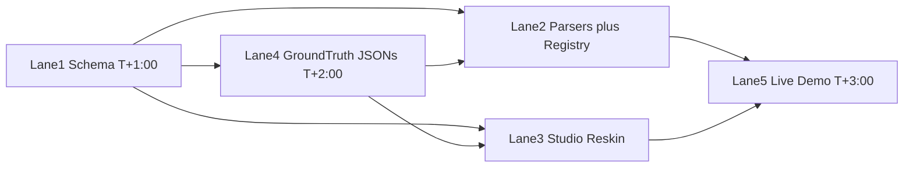

# StateProof — 4-Hour Team Build Plan

> 5 parallel workstreams. The engine already exists in the SynchronAIse repo
> (`C:\Users\salam\Projects\SynchronAIse`) — we port it, re-skin it, and point it at
> cars. Hard rule: **feature freeze at T+3:00**, everything after that is integration,
> seeding, and dry runs. If something isn't working at freeze, it ships in MOCK_MODE.

## T+0:00 – T+0:30 — Bootstrap (everyone together)

- **Integrator** ports from SynchronAIse into this repo: `packages/contract/`,
  `backend/`, `frontend/` (skip `action/` — the GitHub Action is irrelevant here).
  Commit as-is, get MOCK_MODE running end-to-end (old UI demo) so every lane starts
  from a green base. Everyone pulls.
- Everyone else: env setup (Python + `uv`, Node, API keys in `backend/.env` —
  `NVIDIA_API_KEY`, `GEMINI_API_KEY`, `OPENAI_API_KEY`; any one is enough, MOCK_MODE
  covers zero), read this plan, claim your lane.

## The five lanes

### Lane 1 — Contract & Taxonomy Lead

**Owns:** the shared schema everyone else depends on. **Deliver the schema by T+1:00 —
you are the critical path.**

- `backend/app/core/schema.py` + `frontend/src/types/contract.ts`: fixed car element
  types (`front_bumper`, `hood`, `windshield`, `door_fl/fr/rl/rr`, `wheel_fl/fr/rl/rr`,
  `rear`), props `condition`, `defects[]` (type, location, size); every audit carries
  `asset_id` (plate) + `contract_event` (`pickup` / `return`)
- Classification aliases: `damage` / `normal_wear` / `agreed_change` (semantics of
  violation / noise / evolution unchanged)
- Then (by T+2:00): rewrite `classification.md` — damage vs fair-wear taxonomy with
  rental-industry standards (scratch-length thresholds, chip counts), required
  standard citation + indicative cost per finding — and update the heuristic fallback
  in `classifier.py` to match, so MOCK_MODE stays coherent.

### Lane 2 — Backend Lead

**Owns:** parsers + registry. Mock path working by T+2:00, live VLM by T+3:00.

- `figma_parser.py` → `baseline_parser.py`, `code_parser.py` → `return_parser.py`:
  send photos + the fixed checklist schema to the VLM (`vlm.py`), get back a filled
  condition graph **plus any visible license plate**; mock path loads authored JSONs
- Thin Asset Registry in `storage.py`: in-memory assets keyed by plate holding
  `{ baseline, audits[] }`; `POST /audit` without an explicit `asset_id` auto-links
  via the recognized plate and diffs against the registered baseline
- **NVIDIA NIM as first provider** (~20 min, do it while inside `vlm.py`): NIM speaks
  the OpenAI-compatible API, so add `NVIDIA_API_KEY` + `NVIDIA_MODEL` to `config.py`
  and register a provider constructed as
  `OpenAI(base_url="https://integrate.api.nvidia.com/v1", api_key=settings.nvidia_api_key)`
  with a NIM vision model. Chain becomes **NIM → Gemini → OpenAI → heuristic** — if NIM
  fails we degrade exactly as before, so this cannot hurt reliability
- Cut: `GET /assets` timeline endpoint, rebaseline — not in 4 hours

### Lane 3 — Studio Lead

**Owns:** the frontend re-skin. Works against seeded mocks the whole time — no backend
dependency beyond the contract types from Lane 1.

- StateProof branding (name + tagline *"Proof of how it was."*) in the header
- Panels: "Pickup" vs "Return" (`Studio.tsx`, `GraphView.tsx`)
- `DriftScore.tsx` → **Damage Charge Score** in €
- Asset header: license plate display (no timeline UI — cut)
- `ExplanationPanel.tsx`: side-by-side photo evidence, reasoning, cited standard, cost
- `PromptBox.tsx` → "Generate dispute letter" / "Generate charge notice" (existing `/fix`)

### Lane 4 — Data Lead

**Owns:** the demo car and all ground truth. No code skills needed — a phone and care.

- Photograph a real car: **pickup set** and **return set**, plate clearly visible,
  consistent angle per checklist element (front, hood, each door, wheels, rear)
- Only the live-demo case needs real photo pairs: the **pre-registered scratch**
  (photograph an existing scratch at "pickup", same scratch at "return")
- Author the four ground-truth condition-graph JSONs against Lane 1's schema
  (by T+2:00, so Lanes 2–3 can seed):
  1. New dent on door → `damage` (charge justified, cost estimate)
  2. Scratch registered at pickup → **not chargeable** — the registry moment
  3. Dirt / stone-chip dust → `normal_wear`, dismissed with reasoning
  4. Tire replaced with approval on file → `agreed_change`
- Put photos + JSONs in `demo/ground-truth/`
- **Stretch (T+3:00 onward): k3s deploy.** Your data work is done by then — port the
  proven deploy assets from SynchronAIse (`deploy/helm/synchronaise/`, `deploy.ps1`,
  `backend/Dockerfile`) and rename: chart `synchronaise` → `stateproof`, image
  `stateproof-backend:dev`, secret `synchronaise-llm` → `stateproof-llm`. Same
  contract as before: kubectl context `rancher-desktop`, namespace `hackathon`,
  `application-collection` pull secret, then
  `helm upgrade --install stateproof ./deploy/helm/stateproof --namespace hackathon`
  and `kubectl port-forward -n hackathon svc/stateproof 8080:8080`.
  **Rule: do not start this until the live VLM run works — and if it fights you,
  abandon it; local uvicorn is the demo, k3s is bonus credibility**

### Lane 5 — Integrator Lead

**Owns:** the repo staying green during the build. Runs the bootstrap port first.
Pitch + rehearsal are deferred to tomorrow morning's practice (see below).

- After bootstrap: keep MOCK_MODE end-to-end green as lanes merge; resolve integration
  breaks immediately — you outrank everyone on merge conflicts
- T+3:00: wire the live on-stage run — photograph the car → VLM reads the plate →
  registry pulls the pickup baseline → StateProof Report shows the pre-existing
  scratch is **not chargeable**
- T+3:30–4:00: one end-to-end smoke test of the full loop (not a rehearsal — just
  proving every piece connects), then commit a clean, tagged end-of-build state

## Git branching & merge strategy

Parallel lanes only stay fast if **main stays conflict-free**. Every developer works on a **long-lived feature branch** cut from `main`; **only Lane 5 (Integrator) merges into `main`** during the build. No lane merges its own work to `main`.

### Branches and owners

| Branch | Lane | Owner role | Purpose |
|--------|------|------------|---------|
| `feat/bootstrap-port` | Lane 5 | Integrator | Port `packages/contract/`, `backend/`, `frontend/` from SynchronAIse; first green MOCK_MODE on `main` |
| `feat/contract-taxonomy` | Lane 1 | Contract & Taxonomy Lead | Schema, types, classification doc, heuristic classifier |
| `feat/backend-parsers-registry` | Lane 2 | Backend Lead | Parsers, VLM, storage registry, NIM config |
| `feat/studio-reskin` | Lane 3 | Studio Lead | Frontend re-skin only |
| `feat/demo-data` | Lane 4 | Data Lead | Photos + ground-truth JSONs |
| `feat/k3s-deploy` | Lane 4 (stretch) | Data Lead | Helm/Docker deploy assets (**branch cut at T+3:00 only**) |

### Bootstrap-first merge order (non-negotiable)

1. **T+0:00–T+0:30:** All work for the port happens on `feat/bootstrap-port` only. **Do not** cut the other five feature branches for *new commits* until bootstrap is on `main`—empty local branches from `main` at T+0 are fine for naming; real work starts after bootstrap lands.
2. **Lane 5 merges `feat/bootstrap-port` → `main` within 30 minutes** of kickoff. This is the **only** merge that may happen before everyone else rebases.
3. **Immediately after bootstrap is on `main`:** Everyone runs `git fetch origin; git checkout main; git pull; git rebase main` (or recreates their feature branch from updated `main`). **All five lane branches must branch from the post-bootstrap `main`**, not pre-bootstrap history.
4. From T+0:30 onward: lane work stays on the assigned feature branch until the Integrator merges it.

### File ownership boundaries (do not cross lanes)

Touch **only** the paths your branch owns. If you need a change in another lane’s tree, ping that lane or Lane 5—do not “drive-by” edit.

| Branch | Allowed paths | Do not touch |
|--------|---------------|--------------|
| `feat/bootstrap-port` | `packages/contract/**`, `backend/**`, `frontend/**` (initial port only) | `demo/**`, `deploy/**` (except fixes required for green MOCK_MODE agreed with Integrator) |
| `feat/contract-taxonomy` | `backend/app/core/schema.py`, `frontend/src/types/contract.ts`, `backend/**/classification.md`, `backend/**/classifier.py` (heuristic only) | Parsers, `vlm.py`, `storage.py` registry logic, `frontend/src/**` UI (except `contract.ts`) |
| `feat/backend-parsers-registry` | Parser modules, `vlm.py`, `storage.py` (registry), `config.py` (NIM keys/models), related backend tests | `schema.py` / `contract.ts` (Lane 1), `frontend/src/**`, `demo/**` |
| `feat/studio-reskin` | `frontend/src/**` only | `backend/**`, `packages/contract/**` (except consuming types), `demo/**`, `deploy/**` |
| `feat/demo-data` | `demo/ground-truth/**` only | Application source under `backend/`, `frontend/`, `packages/` |
| `feat/k3s-deploy` | `deploy/**` only (plus Dockerfile references under `backend/` if required for image build, coordinated with Lane 2) | Runtime app logic, UI, ground-truth content |

Shared files (`README.md`, `docs/BUILD_PLAN.md`, root CI): **Integrator only**, or one-line fixes with Integrator approval.

### Merge cadence

- **T+1:00 — Lane 1 schema merge:** Integrator merges `feat/contract-taxonomy` → `main` as soon as schema + `contract.ts` are stable. **All other lanes rebase onto `main` the same hour** before continuing parser/UI/JSON work that depends on the schema.
- **Merge early and often:** Prefer small Integrator merges (schema slice, then classifier doc) over one giant merge at T+3:00. Target at least one merge per lane before feature freeze when the lane has a shippable slice.
- **Lane 5 merges; lanes do not self-merge:** Open a PR or hand Integrator a clean, rebased branch. Integrator resolves cross-lane conflicts using ownership rules above.
- **T+3:00 — `feat/k3s-deploy`:** Cut this branch from current `main` only after live VLM path is proven (per Lane 4 stretch rules). Do not start deploy work on a branch created earlier.
- **Feature freeze at T+3:00:** Only bugfixes and integration merges after freeze; no new feature paths.

### Rebase vs merge

- **On your feature branch (daily):** `git fetch origin; git rebase origin/main` to stay current. Use rebase, not merge commits from `main` into your lane branch, to keep history linear and conflicts small.
- **Integrator bringing a lane to `main`:** Rebase the feature branch onto latest `main`, run MOCK_MODE smoke, then **merge with merge commit** (or squash per team preference) via Integrator. Never force-push `main`.
- **Do not** rebase shared branches other people have checked out without coordinating. Rebasing **your** lane branch before handoff to Integrator is expected.

### If you hit merge conflicts

1. **Stop and identify ownership:** Whose path is conflicted? The **owner lane** supplies the correct resolution; Integrator adjudicates ties.
2. **Rebase workflow:** `git rebase origin/main` → fix conflicts file-by-file → `git add` → `git rebase --continue`. If stuck: `git rebase --abort`, sync with Integrator.
3. **Schema conflicts (T+1:00):** Lane 1 wins on `schema.py` and `contract.ts`; other lanes re-apply their changes on top after rebasing.
4. **Bootstrap vs lane:** Post-bootstrap, `main` wins; lanes rebase and re-apply. Never revert bootstrap on `main` to “fix” a lane.
5. **Escalation:** Lane 5 (Integrator) has final say on conflict resolution during the build. When in doubt, keep MOCK_MODE green and defer non-critical changes.

### Quick checklist per developer

- [ ] On the correct feature branch for your lane  
- [ ] Branched from **post-bootstrap** `main`  
- [ ] Only editing paths in your ownership table  
- [ ] Rebased after Lane 1 schema merge at T+1:00  
- [ ] Handed off to Integrator for merges to `main`—never self-merge

## Timeline at a glance

| Time | Lane 1 | Lane 2 | Lane 3 | Lane 4 | Lane 5 |
|---|---|---|---|---|---|
| 0:00–0:30 | bootstrap | bootstrap | bootstrap | start photos | port + green base |
| 0:30–1:00 | **schema out** | parser skeletons | branding + labels | photos | keep green |
| 1:00–2:00 | classifier prompt | parsers vs mock | score + panels | **JSONs out** | integrate |
| 2:00–3:00 | heuristic + polish | registry + NIM + live VLM | evidence panel | seed + verify | integrate |
| 3:00–4:00 | — freeze — | — freeze — | — freeze — | k3s stretch | live run + smoke test |

## Tomorrow morning — practice session

Deferred from the build on purpose: the last build hour is integration buffer, and
rehearsal happens fresh.

- **Pitch** (Lane 5 leads, everyone contributes): rental-dispute pain → live demo →
  taste story (`normal_wear` reasoning is the differentiator) → ledger framing
  ("the asset owns its history") → roadmap (apartments, equipment, insurance)
- **Two full dry runs** of the live moment: photograph the car → plate read →
  registry baseline → "pre-existing scratch not chargeable"
- **Verify the fallback**: seeded case 2 must tell the same story offline if the live
  VLM misbehaves on stage
- Assign speaking parts and time the pitch

## Cut list (4-hour reality)

- Apartment second-act mock — roadmap slide only now
- Asset timeline UI + `GET /assets` + rebaseline — plate lookup only
- GitHub Action — not ported
- Cost accuracy — flat per-category estimates labeled "indicative"
- Anything not green at T+3:00 ships in MOCK_MODE
- k3s deploy is a stretch, never a blocker: local uvicorn is the demo path; NIM is
  additive (fallback chain unchanged below it)

## Dependencies between lanes

