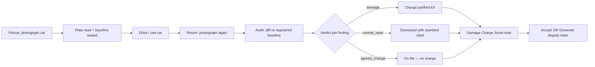

# Frontend track — StateProof Studio

> **Branch:** `feat/frontend` · **Owner:** Salam · **Done by T+3:00**
> **Allowed paths:** `frontend/src/**` only — do not touch `backend/`, `packages/`, `demo/`.

Work from seeded mocks (`frontend/src/mocks/audit.json`) — no live backend required until
integration wires the live demo. Stable `contract.ts` from Backend — AI lands on `main` by
**T+1:00** (task F7).

Full build timeline: [BUILD_PLAN.md](BUILD_PLAN.md) · Product context: [README.md](../README.md)

---

## The day-to-day problem

**Persona:** Alex, returning a rental car at 6pm on a Friday.

**Pain:** The agent circles a door scratch on a tablet and says *"€280 damage charge."* Alex
is sure it was there at pickup — but has no proof, no shared record, and no language for
*"that's normal wear, not damage."* The desk wins by default because the company holds the
deposit.

**StateProof reframes this:** The car (via license plate) owns an auditable history. Pickup
photos become the baseline; return photos are compared automatically; every difference is
classified as **damage**, **normal wear**, or **agreed change** — with cited standards and
indicative costs.

---

## Journey map summary

**Emotional beats:**

1. **Pickup** — "I'm documenting this so I'm protected" (quick checklist photo flow)
2. **Return** — tension at the desk; agent and renter look at the same screen
3. **Reveal** — score animates; pre-existing scratch flips to green *"not chargeable"*
4. **Resolution** — one tap: dispute letter or charge notice

---

## Tasks F1–F7

| # | Task | File(s) | When |
|---|------|---------|------|
| F1 | StateProof branding + tagline *"Proof of how it was."* | `App.tsx`, `Studio.tsx` | T+0:30–1:00 |
| F2 | Relabel panels: **Pickup** vs **Return** | `Studio.tsx`, `GraphView.tsx` | T+1:00–2:00 |
| F3 | Drift score → **Damage Charge Score** (€) | `DriftScore.tsx` | T+1:00–2:00 |
| F4 | License plate in asset header | `Studio.tsx` | T+2:00–3:00 |
| F5 | Photo evidence, reasoning, cited standard, cost | `ExplanationPanel.tsx` | T+2:00–3:00 |
| F6 | "Generate dispute letter" / "Generate charge notice" | `PromptBox.tsx` | T+2:00–3:00 |
| F7 | Wire updated types | `frontend/src/types/contract.ts` | after T+1:00 |

**Classification relabels** (F5/F6, when schema lands):

| Engine (SynchronAIse) | StateProof |
|-----------------------|------------|
| `design_violation` | `damage` |
| `technical_noise` | `normal_wear` |
| `intentional_evolution` | `agreed_change` |

---

## UI & interaction ideas

| Interaction | Purpose | Build tier |
|-------------|---------|------------|
| Checklist photo capture | Guided angles (front bumper → hood → doors → wheels → rear); plate visible in first shot | Core |
| Side-by-side evidence panel | Pickup photo \| Return photo for selected body part; pinch-zoom on mobile | Core (F5) |
| Dual graph: Pickup vs Return | React-flow nodes = car elements; color = classification | Core (F2) |
| Tap-to-classify nodes | Tap `door_fl` → panel shows reasoning + standard + € estimate | Core |
| Animated Damage Charge Score | € counter ticks up/down as findings load; green if €0 liability | Core (F3) |
| License plate header | `AB-123-CD` prominent — "this car's ledger" | Core (F4) |
| Generate dispute letter | Existing `/fix` flow; copy + optional **voice read-aloud** (Web Speech API) | Core letter / stretch voice |
| Short video walkaround upload | 30s clip as alternative to per-angle photos | Stretch |
| "Registry moment" highlight | Case 2: scratch pulses with badge *"Registered at pickup — not chargeable twice"* | Demo polish |

**Hackathon story hook:** Voice read-aloud of the dispute letter at the desk — renter hears
their case in plain language while the agent sees the evidence. Video walkaround is the
"better interactive" stretch if photo flow is green early.

---

## Build first vs stretch (4-hour window)

### Build first (T+0:30 → T+2:00) — F1–F4

- F1: StateProof branding + tagline in header
- F2: Rename graph headers → **Pickup** / **Return**
- F3: `DriftScore` → **Damage Charge Score (€)** with simple count-up animation
- F4: License plate in topbar (from mock `asset_id`)

### Next (T+2:00 → T+3:00) — F5–F7

- F5: Evidence panel — side-by-side photos + reasoning + standard + cost
- F6: Re-label classifications + dispute/charge notice prompts
- F7: Consume updated `contract.ts` from Backend — AI

### Stretch (T+3:00+)

- Web Speech API voice read
- Video upload UI (wire later)
- Registry badge animation for demo case 2 (registered scratch → not chargeable)
- Mobile-friendly capture flow (if time)

**Rule:** Work against `frontend/src/mocks/audit.json` the entire time — no live backend
dependency until integration wires the live demo at T+3:00.

---

## Stretch items (hackathon criteria #3)

These map to the hackathon brief for "better interactive solution using video, voice, etc."
Only after F1–F7 are green:

| Item | Notes |
|------|-------|
| Voice read-aloud | Web Speech API on generated dispute letter |
| Video walkaround | 30s upload UI; backend wiring is post-hackathon |
| Registry pulse animation | Demo case D5 — pre-registered scratch |
| Mobile capture flow | Guided checklist if desktop demo is stable |

---

## First-hour checklist (Salam)

After bootstrap merges to `main` (or work on `feat/frontend` rebased onto it):

- [ ] `git checkout feat/frontend` → `git pull` → `git rebase main`
- [ ] `cd frontend && npm install && npm run dev`
- [ ] Open `#/report/pr-1-run-1` — verify SynchronAIse mock loads (pre-rebrand is expected)
- [ ] **First commit: F1 + F2** — StateProof branding + Pickup/Return labels (~15 min)
- [ ] Sketch evidence panel layout (pickup thumb | return thumb, reasoning below) for F5
- [ ] Ask Demo track for one door-scratch photo pair early for side-by-side dev
- [ ] Rebase after Backend — AI merges `contract.ts` at T+1:00 before F7

**Prep notes** (SynchronAIse → StateProof renames):

- `DriftScore.tsx`: SynchronAIse → StateProof, Drift score → Damage Charge Score (€)
- `GraphView.tsx`: "Design intent" / "Implementation" → Pickup / Return
- `ExplanationPanel.tsx`: classification label mapping (see table above)

---

## Dependencies & blockers

| Blocker | Owner | Unblock |
|---------|-------|---------|
| `frontend/` bootstrap | Integration (`feat/integration`) | Port from SynchronAIse; merge → `main` by T+0:30 |
| `contract.ts` car schema | Backend — AI (`feat/backend-ai`) | F7; can start F1–F6 with existing mock |
| Seeded car JSON + photos | Demo (`feat/demo`) | Realistic evidence panel by T+2:00 |

**Do not self-merge to `main`** — hand off to Integration track for merge.
